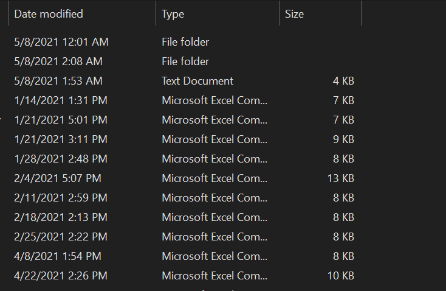
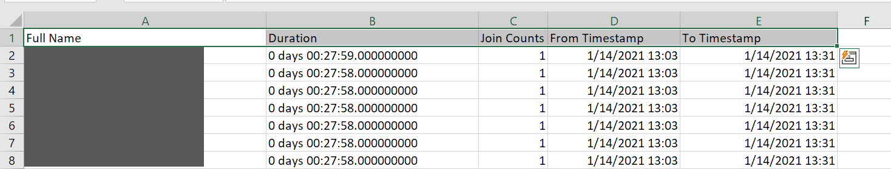

# Microsoft Teams Attendance

This python script made for calculating the attendance data (duration, joining count, join timestamp, leave timestamp) of students.

This script is use `date  modified` as end class time.



## Usage
- Install pandas package.
```bash
pip install pandas
```
- Run script file.
```bash
python script.py "<csv_filename>"
```
the name of output file is `Output_<csv_filename>`.
 
## Example output file
